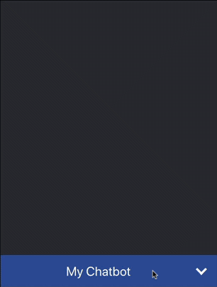

# react-lex-plus

ReactJS AWS Lex Chat Component with additional features. Based on [React-Lex project](https://github.com/promediacorp/react-lex). Credits go to the original authors
[promediacorp](https://github.com/promediacorp/) and [Alex Baranov](https://github.com/ab320012). My work builds on top of the work these giants have contributed.

## Additional Features

- [x] Ability to customize header styling using inline CSS
- [x] Ability to customize lexUserId
- [x] Ability to customize initial greeting message

## Demo



## Prerequisites

The AWS Javascript SDK for the browser is required. This package will install the entire SDK, but all you need is AWS.LexRuntime and AWS.CognitoIdentity. We recommend you build your own version of the AWS SDK for JavaScript using the [builder](https://sdk.amazonaws.com/builder/js/) to include only the services you need.

You will need to set up an AWS Cognito federated identity pool, and pass the IdentityPoolId as props to the component. Be sure to enable access to unauthenticated identities, and modify the IAM roles to allow access to Amazon Lex. From the IAM console, attach the AmazonLexRunBotsOnly and AmazonPollyReadOnlyAccess policies. [This blog post](https://aws.amazon.com/blogs/ai/greetings-visitor-engage-your-web-users-with-amazon-lex/) walks through the process in detail.

## Installing react-lex

```
npm install --save react-lex-plus
```

## Using the Component

The LexChat component has the following props available to you

- botName (required - String) - The name of the bot as configured in AWS Lex
- IdentityPoolId (required - String) - The cognito identity pool Id as configured in AWS cognito for the bot
- placeholder (optional - String) - The placeholder text in the input textfield in the chat UI
- backgroundColor (optional - String) - The background color of the conversation portion of chat UI
- height (optional - string) - The height of the chat UI
- region (optional - string) - The AWS region of AWS Lex used (defaults to us-east-1 if not provided)
- headerText (optional - string) - The text that shows up in the header
- headerStyle (optional - object) - An object that takes CSS styles to be applied to the header
- greeting (optional - string) - The initial message the bot sends to the user

### Example

```js
import LexChat from "react-lex-plus";

class App extends Component {
  render() {
    <LexChat
      botName="OrderFlowers"
      IdentityPoolId="us-east-1:7292b8c0-56f1-4441-b2a6-xxxxxxxxxxxx"
      placeholder="Placeholder text"
      backgroundColor="#FFFFFF"
      height="430px"
      region="us-east-1"
      headerText="Chat with our awesome bot"
      headerStyle={{ backgroundColor: "#ABD5D9", fontSize: "30px" }}
      greeting={
        "Hello, how can I help? You can say things like 'help' to get more info"
      }
    />;
  }
}
export default App;
```

- Your botname (ie. "OrderFlowers") is a required prop.
- Your IdentityPoolId is a required prop.

##License

The MIT License (MIT)

Copyright (c) 2017.

Permission is hereby granted, free of charge, to any person obtaining a copy of this software and associated documentation files (the "Software"), to deal in the Software without restriction, including without limitation the rights to use, copy, modify, merge, publish, distribute, sublicense, and/or sell copies of the Software, and to permit persons to whom the Software is furnished to do so, subject to the following conditions:

The above copyright notice and this permission notice shall be included in all copies or substantial portions of the Software.

THE SOFTWARE IS PROVIDED "AS IS", WITHOUT WARRANTY OF ANY KIND, EXPRESS OR IMPLIED, INCLUDING BUT NOT LIMITED TO THE WARRANTIES OF MERCHANTABILITY, FITNESS FOR A PARTICULAR PURPOSE AND NONINFRINGEMENT. IN NO EVENT SHALL THE AUTHORS OR COPYRIGHT HOLDERS BE LIABLE FOR ANY CLAIM, DAMAGES OR OTHER LIABILITY, WHETHER IN AN ACTION OF CONTRACT, TORT OR OTHERWISE, ARISING FROM, OUT OF OR IN CONNECTION WITH THE SOFTWARE OR THE USE OR OTHER DEALINGS IN THE SOFTWARE.
